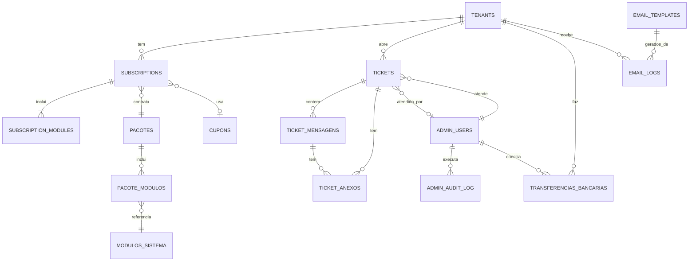

# 🗄️ Estrutura de Banco de Dados - Admin SaaS

## 📋 Visão Geral

Este documento descreve a estrutura completa de banco de dados para o sistema de administração do SaaS.

---

## 🏗️ Tabelas Principais

### 1. `tenants` - Assinantes/Tenants

```sql
CREATE TABLE tenants (
    id UUID PRIMARY KEY DEFAULT uuid_generate_v4(),

    -- Identificação
    codigo VARCHAR(50) UNIQUE NOT NULL, -- slug para URL
    nome_empresa VARCHAR(255) NOT NULL,
    cnpj VARCHAR(14) UNIQUE,

    -- Responsável
    nome_responsavel VARCHAR(255) NOT NULL,
    email VARCHAR(255) UNIQUE NOT NULL,
    telefone VARCHAR(20),

    -- Status
    status VARCHAR(20) NOT NULL DEFAULT 'trial', -- trial, ativo, suspenso, cancelado, inadimplente
    data_cadastro TIMESTAMP NOT NULL DEFAULT NOW(),
    data_ativacao TIMESTAMP,
    data_ultimo_acesso TIMESTAMP,

    -- Configuração
    subdomain VARCHAR(100) UNIQUE, -- subdominio.agrosass.com
    database_name VARCHAR(100) UNIQUE, -- Nome do banco de dados do tenant

    -- Storage
    storage_usado_mb BIGINT DEFAULT 0,
    storage_limite_mb BIGINT DEFAULT 10240, -- 10GB padrão

    -- Usuários
    usuarios_ativos INTEGER DEFAULT 0,
    usuarios_limite INTEGER DEFAULT 5,

    -- Metadata
    timezone VARCHAR(50) DEFAULT 'America/Sao_Paulo',
    locale VARCHAR(10) DEFAULT 'pt-BR',

    -- Auditoria
    criado_em TIMESTAMP NOT NULL DEFAULT NOW(),
    atualizado_em TIMESTAMP NOT NULL DEFAULT NOW(),
    criado_por UUID, -- ID do admin que criou

    CONSTRAINT chk_status CHECK (status IN ('trial', 'ativo', 'suspenso', 'cancelado', 'inadimplente'))
);

CREATE INDEX idx_tenants_status ON tenants(status);
CREATE INDEX idx_tenants_email ON tenants(email);
CREATE INDEX idx_tenants_data_cadastro ON tenants(data_cadastro);
```

---

### 2. `subscriptions` - Assinaturas

```sql
CREATE TABLE subscriptions (
    id UUID PRIMARY KEY DEFAULT uuid_generate_v4(),
    tenant_id UUID NOT NULL REFERENCES tenants(id) ON DELETE CASCADE,

    -- Plano
    pacote_id UUID NOT NULL REFERENCES pacotes(id),

    -- Tipo
    tipo VARCHAR(20) NOT NULL DEFAULT 'mensal', -- mensal, anual
    status VARCHAR(20) NOT NULL DEFAULT 'ativa', -- ativa, trial, suspensa, cancelada, pendente

    -- Trial
    is_trial BOOLEAN DEFAULT FALSE,
    trial_inicio DATE,
    trial_fim DATE,

    -- Valores
    valor_mensal DECIMAL(10, 2) NOT NULL,
    valor_desconto DECIMAL(10, 2) DEFAULT 0,
    cupom_id UUID REFERENCES cupons(id),

    -- Datas
    data_inicio DATE NOT NULL,
    data_fim DATE,
    proximo_vencimento DATE NOT NULL,

    -- Pagamento
    forma_pagamento VARCHAR(20), -- cartao, boleto, transferencia, pix
    stripe_subscription_id VARCHAR(255),
    stripe_customer_id VARCHAR(255),

    -- Renovação
    renovacao_automatica BOOLEAN DEFAULT TRUE,
    cancelamento_agendado BOOLEAN DEFAULT FALSE,
    data_cancelamento DATE,
    motivo_cancelamento TEXT,

    -- Auditoria
    criado_em TIMESTAMP NOT NULL DEFAULT NOW(),
    atualizado_em TIMESTAMP NOT NULL DEFAULT NOW(),
    aprovado_por UUID, -- ID do admin que aprovou
    aprovado_em TIMESTAMP,

    CONSTRAINT chk_subscription_status CHECK (status IN ('ativa', 'trial', 'suspensa', 'cancelada', 'pendente'))
);

CREATE INDEX idx_subscriptions_tenant ON subscriptions(tenant_id);
CREATE INDEX idx_subscriptions_status ON subscriptions(status);
CREATE INDEX idx_subscriptions_vencimento ON subscriptions(proximo_vencimento);
```

---

### 3. `subscription_modules` - Módulos por Assinatura

```sql
CREATE TABLE subscription_modules (
    id UUID PRIMARY KEY DEFAULT uuid_generate_v4(),
    subscription_id UUID NOT NULL REFERENCES subscriptions(id) ON DELETE CASCADE,
    modulo_codigo VARCHAR(50) NOT NULL, -- Ex: A1_PLANEJAMENTO

    ativo BOOLEAN DEFAULT TRUE,

    -- Se foi add-on (módulo extra comprado separadamente)
    is_addon BOOLEAN DEFAULT FALSE,
    valor_adicional DECIMAL(10, 2) DEFAULT 0,

    data_ativacao TIMESTAMP NOT NULL DEFAULT NOW(),
    data_desativacao TIMESTAMP,

    UNIQUE(subscription_id, modulo_codigo)
);

CREATE INDEX idx_subscription_modules_subscription ON subscription_modules(subscription_id);
```

---

### 4. `pacotes` - Pacotes Comerciais

```sql
CREATE TABLE pacotes (
    id UUID PRIMARY KEY DEFAULT uuid_generate_v4(),
    codigo VARCHAR(50) UNIQUE NOT NULL, -- PLAN-BASIC, PLAN-PRO, etc

    -- Informações
    nome VARCHAR(100) NOT NULL,
    descricao TEXT,
    descricao_marketing TEXT,

    -- Preços
    preco_mensal DECIMAL(10, 2) NOT NULL,
    preco_anual DECIMAL(10, 2) NOT NULL,
    desconto_anual INTEGER DEFAULT 0, -- Percentual

    -- Recursos
    max_usuarios_simultaneos INTEGER DEFAULT 5,
    storage_gb INTEGER DEFAULT 10,

    -- Trial
    tem_trial BOOLEAN DEFAULT TRUE,
    dias_trial INTEGER DEFAULT 15,
    is_free BOOLEAN DEFAULT FALSE,

    -- Limites Customizados (JSONB)
    limites_customizados JSONB DEFAULT '{}',
    -- Exemplo: {"max_fazendas": 10, "max_safras_ativas": 3}

    -- Apresentação
    ativo BOOLEAN DEFAULT TRUE,
    destaque BOOLEAN DEFAULT FALSE, -- "Mais Popular"
    ordem INTEGER DEFAULT 0,

    -- Auditoria
    criado_em TIMESTAMP NOT NULL DEFAULT NOW(),
    atualizado_em TIMESTAMP NOT NULL DEFAULT NOW(),
    criado_por UUID
);

CREATE INDEX idx_pacotes_ativo ON pacotes(ativo);
CREATE INDEX idx_pacotes_ordem ON pacotes(ordem);
```

---

### 5. `pacote_modulos` - Módulos incluídos em cada pacote

```sql
CREATE TABLE pacote_modulos (
    id UUID PRIMARY KEY DEFAULT uuid_generate_v4(),
    pacote_id UUID NOT NULL REFERENCES pacotes(id) ON DELETE CASCADE,
    modulo_codigo VARCHAR(50) NOT NULL,

    UNIQUE(pacote_id, modulo_codigo)
);

CREATE INDEX idx_pacote_modulos_pacote ON pacote_modulos(pacote_id);
```

---

### 6. `modulos_sistema` - Catálogo de Módulos

```sql
CREATE TABLE modulos_sistema (
    id UUID PRIMARY KEY DEFAULT uuid_generate_v4(),
    codigo VARCHAR(50) UNIQUE NOT NULL, -- A1_PLANEJAMENTO, P1_REBANHO, etc

    -- Informações
    nome VARCHAR(100) NOT NULL,
    descricao TEXT,
    icone VARCHAR(50),

    -- Hierarquia
    dominio VARCHAR(20) NOT NULL, -- agricola, pecuaria, financeiro, operacional
    modulo_pai_codigo VARCHAR(50), -- Para submódulos

    -- Comercialização
    comercializavel BOOLEAN DEFAULT TRUE,
    preco_adicional DECIMAL(10, 2) DEFAULT 0,

    -- Dependências (Array)
    requer_modulos VARCHAR(50)[], -- Ex: ['CORE', 'A1_PLANEJAMENTO']

    -- Status
    ativo BOOLEAN DEFAULT TRUE,
    em_desenvolvimento BOOLEAN DEFAULT FALSE,
    data_lancamento DATE,

    -- Ordem de exibição
    ordem INTEGER DEFAULT 0,

    criado_em TIMESTAMP NOT NULL DEFAULT NOW(),
    atualizado_em TIMESTAMP NOT NULL DEFAULT NOW(),

    CONSTRAINT chk_dominio CHECK (dominio IN ('agricola', 'pecuaria', 'financeiro', 'operacional'))
);

CREATE INDEX idx_modulos_codigo ON modulos_sistema(codigo);
CREATE INDEX idx_modulos_dominio ON modulos_sistema(dominio);
CREATE INDEX idx_modulos_comercializavel ON modulos_sistema(comercializavel);
```

---

### 7. `cupons` - Cupons de Desconto

```sql
CREATE TABLE cupons (
    id UUID PRIMARY KEY DEFAULT uuid_generate_v4(),
    codigo VARCHAR(50) UNIQUE NOT NULL, -- PROMO2024, BLACK50

    -- Tipo de Desconto
    tipo VARCHAR(20) NOT NULL, -- percentual, valor_fixo
    valor DECIMAL(10, 2) NOT NULL,

    -- Aplicação
    aplicavel_em VARCHAR(30) NOT NULL DEFAULT 'primeira_mensalidade',
    -- primeira_mensalidade, todos_meses, plano_anual
    duracao_meses INTEGER, -- Se aplicável em todos_meses

    -- Restrições
    planos_validos UUID[], -- Array de IDs de pacotes (vazio = todos)
    uso_maximo INTEGER DEFAULT 1,
    uso_atual INTEGER DEFAULT 0,
    uso_por_cliente INTEGER DEFAULT 1,

    -- Validade
    data_inicio DATE NOT NULL,
    data_fim DATE NOT NULL,
    ativo BOOLEAN DEFAULT TRUE,

    -- Auditoria
    criado_por UUID,
    criado_em TIMESTAMP NOT NULL DEFAULT NOW(),
    atualizado_em TIMESTAMP NOT NULL DEFAULT NOW(),

    CONSTRAINT chk_cupom_tipo CHECK (tipo IN ('percentual', 'valor_fixo')),
    CONSTRAINT chk_cupom_aplicavel CHECK (aplicavel_em IN ('primeira_mensalidade', 'todos_meses', 'plano_anual'))
);

CREATE INDEX idx_cupons_codigo ON cupons(codigo);
CREATE INDEX idx_cupons_ativo ON cupons(ativo);
CREATE INDEX idx_cupons_validade ON cupons(data_inicio, data_fim);
```

---

### 8. `tickets` - Suporte

```sql
CREATE TABLE tickets (
    id UUID PRIMARY KEY DEFAULT uuid_generate_v4(),
    numero VARCHAR(50) UNIQUE NOT NULL, -- TICKET-2024-001234

    -- Relacionamento
    tenant_id UUID NOT NULL REFERENCES tenants(id) ON DELETE CASCADE,
    usuario_id UUID, -- ID do usuário no tenant
    usuario_nome VARCHAR(255) NOT NULL,
    usuario_email VARCHAR(255) NOT NULL,

    -- Classificação
    categoria VARCHAR(20) NOT NULL, -- tecnico, financeiro, comercial, duvida
    prioridade VARCHAR(20) NOT NULL DEFAULT 'normal', -- baixa, normal, alta, critica
    status VARCHAR(30) NOT NULL DEFAULT 'aberto',
    -- aberto, em_atendimento, aguardando_cliente, resolvido, fechado

    -- Conteúdo
    assunto VARCHAR(255) NOT NULL,
    descricao TEXT NOT NULL,

    -- Atendimento
    atendente_id UUID REFERENCES admin_users(id),
    data_abertura TIMESTAMP NOT NULL DEFAULT NOW(),
    data_primeira_resposta TIMESTAMP,
    data_resolucao TIMESTAMP,
    sla_vencimento TIMESTAMP NOT NULL,

    -- Satisfação
    avaliacao_nota INTEGER, -- 1-5
    avaliacao_comentario TEXT,
    avaliacao_data TIMESTAMP,

    -- Auditoria
    criado_em TIMESTAMP NOT NULL DEFAULT NOW(),
    atualizado_em TIMESTAMP NOT NULL DEFAULT NOW(),

    CONSTRAINT chk_ticket_categoria CHECK (categoria IN ('tecnico', 'financeiro', 'comercial', 'duvida')),
    CONSTRAINT chk_ticket_prioridade CHECK (prioridade IN ('baixa', 'normal', 'alta', 'critica')),
    CONSTRAINT chk_ticket_status CHECK (status IN ('aberto', 'em_atendimento', 'aguardando_cliente', 'resolvido', 'fechado')),
    CONSTRAINT chk_avaliacao_nota CHECK (avaliacao_nota IS NULL OR (avaliacao_nota >= 1 AND avaliacao_nota <= 5))
);

CREATE INDEX idx_tickets_tenant ON tickets(tenant_id);
CREATE INDEX idx_tickets_status ON tickets(status);
CREATE INDEX idx_tickets_prioridade ON tickets(prioridade);
CREATE INDEX idx_tickets_atendente ON tickets(atendente_id);
CREATE INDEX idx_tickets_sla ON tickets(sla_vencimento);
```

---

### 9. `ticket_mensagens` - Mensagens do Ticket

```sql
CREATE TABLE ticket_mensagens (
    id UUID PRIMARY KEY DEFAULT uuid_generate_v4(),
    ticket_id UUID NOT NULL REFERENCES tickets(id) ON DELETE CASCADE,

    -- Autor
    autor_tipo VARCHAR(20) NOT NULL, -- cliente, atendente, sistema
    autor_id UUID, -- ID do usuário ou atendente
    autor_nome VARCHAR(255) NOT NULL,

    -- Conteúdo
    mensagem TEXT NOT NULL,
    mensagem_html TEXT,

    -- Controle
    visualizado BOOLEAN DEFAULT FALSE,
    data_visualizacao TIMESTAMP,

    criado_em TIMESTAMP NOT NULL DEFAULT NOW(),

    CONSTRAINT chk_autor_tipo CHECK (autor_tipo IN ('cliente', 'atendente', 'sistema'))
);

CREATE INDEX idx_ticket_mensagens_ticket ON ticket_mensagens(ticket_id);
CREATE INDEX idx_ticket_mensagens_criado ON ticket_mensagens(criado_em);
```

---

### 10. `ticket_anexos` - Anexos de Tickets

```sql
CREATE TABLE ticket_anexos (
    id UUID PRIMARY KEY DEFAULT uuid_generate_v4(),
    ticket_id UUID REFERENCES tickets(id) ON DELETE CASCADE,
    mensagem_id UUID REFERENCES ticket_mensagens(id) ON DELETE CASCADE,

    nome_arquivo VARCHAR(255) NOT NULL,
    tamanho_bytes BIGINT NOT NULL,
    mime_type VARCHAR(100) NOT NULL,
    url VARCHAR(500) NOT NULL,

    criado_em TIMESTAMP NOT NULL DEFAULT NOW(),

    CONSTRAINT chk_anexo_relacionamento CHECK (
        (ticket_id IS NOT NULL AND mensagem_id IS NULL) OR
        (ticket_id IS NULL AND mensagem_id IS NOT NULL)
    )
);

CREATE INDEX idx_ticket_anexos_ticket ON ticket_anexos(ticket_id);
CREATE INDEX idx_ticket_anexos_mensagem ON ticket_anexos(mensagem_id);
```

---

### 11. `transferencias_bancarias` - Transferências

```sql
CREATE TABLE transferencias_bancarias (
    id UUID PRIMARY KEY DEFAULT uuid_generate_v4(),

    -- Relacionamento
    tenant_id UUID NOT NULL REFERENCES tenants(id) ON DELETE CASCADE,
    subscription_id UUID REFERENCES subscriptions(id),

    -- Dados da Transferência
    valor DECIMAL(10, 2) NOT NULL,
    data_transferencia DATE NOT NULL,
    comprovante_url VARCHAR(500),

    -- Referência
    referencia_mes VARCHAR(7), -- YYYY-MM
    descricao TEXT,

    -- Conciliação
    status VARCHAR(20) NOT NULL DEFAULT 'pendente', -- pendente, conciliado, rejeitado
    conciliado_por UUID REFERENCES admin_users(id),
    conciliado_em TIMESTAMP,
    observacoes TEXT,

    -- Auditoria
    criado_em TIMESTAMP NOT NULL DEFAULT NOW(),
    atualizado_em TIMESTAMP NOT NULL DEFAULT NOW(),

    CONSTRAINT chk_transferencia_status CHECK (status IN ('pendente', 'conciliado', 'rejeitado'))
);

CREATE INDEX idx_transferencias_tenant ON transferencias_bancarias(tenant_id);
CREATE INDEX idx_transferencias_status ON transferencias_bancarias(status);
CREATE INDEX idx_transferencias_data ON transferencias_bancarias(data_transferencia);
```

---

### 12. `email_templates` - Templates de Email

```sql
CREATE TABLE email_templates (
    id UUID PRIMARY KEY DEFAULT uuid_generate_v4(),
    codigo VARCHAR(50) UNIQUE NOT NULL, -- WELCOME, TRIAL_ENDING, etc

    -- Informações
    nome VARCHAR(100) NOT NULL,
    descricao TEXT,

    -- Conteúdo
    assunto VARCHAR(255) NOT NULL,
    corpo_html TEXT NOT NULL,
    corpo_texto TEXT NOT NULL,

    -- Variáveis disponíveis (Array)
    variaveis VARCHAR(50)[], -- Ex: ['nome_usuario', 'tenant_nome', 'data_vencimento']

    -- Configuração
    tipo VARCHAR(20) NOT NULL, -- transacional, marketing, sistema
    ativo BOOLEAN DEFAULT TRUE,

    -- Auditoria
    criado_em TIMESTAMP NOT NULL DEFAULT NOW(),
    atualizado_em TIMESTAMP NOT NULL DEFAULT NOW(),
    editado_por UUID REFERENCES admin_users(id),

    CONSTRAINT chk_email_tipo CHECK (tipo IN ('transacional', 'marketing', 'sistema'))
);

CREATE INDEX idx_email_templates_codigo ON email_templates(codigo);
CREATE INDEX idx_email_templates_tipo ON email_templates(tipo);
```

---

### 13. `email_logs` - Histórico de Envios

```sql
CREATE TABLE email_logs (
    id UUID PRIMARY KEY DEFAULT uuid_generate_v4(),

    -- Template
    template_id UUID REFERENCES email_templates(id),
    template_codigo VARCHAR(50),

    -- Destinatário
    destinatario_email VARCHAR(255) NOT NULL,
    destinatario_nome VARCHAR(255),
    tenant_id UUID REFERENCES tenants(id),

    -- Conteúdo Enviado
    assunto VARCHAR(255) NOT NULL,
    corpo_html TEXT,

    -- Status
    status VARCHAR(20) NOT NULL, -- enviado, falha, pendente
    erro_mensagem TEXT,

    -- Provider
    provider VARCHAR(50), -- smtp, sendgrid, mailgun, etc
    provider_message_id VARCHAR(255),

    -- Tracking
    aberto BOOLEAN DEFAULT FALSE,
    data_abertura TIMESTAMP,
    clicado BOOLEAN DEFAULT FALSE,
    data_clique TIMESTAMP,

    -- Auditoria
    enviado_em TIMESTAMP NOT NULL DEFAULT NOW(),

    CONSTRAINT chk_email_status CHECK (status IN ('enviado', 'falha', 'pendente'))
);

CREATE INDEX idx_email_logs_destinatario ON email_logs(destinatario_email);
CREATE INDEX idx_email_logs_tenant ON email_logs(tenant_id);
CREATE INDEX idx_email_logs_template ON email_logs(template_id);
CREATE INDEX idx_email_logs_enviado ON email_logs(enviado_em);
```

---

### 14. `admin_users` - Usuários Administradores

```sql
CREATE TABLE admin_users (
    id UUID PRIMARY KEY DEFAULT uuid_generate_v4(),

    -- Credenciais
    email VARCHAR(255) UNIQUE NOT NULL,
    senha_hash VARCHAR(255) NOT NULL,

    -- Dados Pessoais
    nome VARCHAR(255) NOT NULL,
    avatar_url VARCHAR(500),

    -- Perfil
    role VARCHAR(20) NOT NULL DEFAULT 'admin',
    -- super_admin, admin, suporte, financeiro, comercial

    -- Status
    ativo BOOLEAN DEFAULT TRUE,
    ultimo_acesso TIMESTAMP,

    -- Preferências
    timezone VARCHAR(50) DEFAULT 'America/Sao_Paulo',
    locale VARCHAR(10) DEFAULT 'pt-BR',

    -- Auditoria
    criado_em TIMESTAMP NOT NULL DEFAULT NOW(),
    atualizado_em TIMESTAMP NOT NULL DEFAULT NOW(),
    criado_por UUID REFERENCES admin_users(id),

    CONSTRAINT chk_admin_role CHECK (role IN ('super_admin', 'admin', 'suporte', 'financeiro', 'comercial'))
);

CREATE INDEX idx_admin_users_email ON admin_users(email);
CREATE INDEX idx_admin_users_ativo ON admin_users(ativo);
```

---

### 15. `admin_audit_log` - Log de Auditoria

```sql
CREATE TABLE admin_audit_log (
    id UUID PRIMARY KEY DEFAULT uuid_generate_v4(),

    -- Quem
    admin_user_id UUID NOT NULL REFERENCES admin_users(id),
    admin_email VARCHAR(255) NOT NULL,

    -- O que
    acao VARCHAR(100) NOT NULL, -- Ex: tenant.impersonate, subscription.suspend, ticket.assign
    entidade VARCHAR(50) NOT NULL, -- tenant, subscription, ticket, etc
    entidade_id UUID,

    -- Detalhes
    descricao TEXT,
    dados_anteriores JSONB, -- Estado antes da mudança
    dados_novos JSONB, -- Estado depois da mudança

    -- Contexto
    ip_address VARCHAR(45),
    user_agent TEXT,

    -- Timestamp
    criado_em TIMESTAMP NOT NULL DEFAULT NOW()
);

CREATE INDEX idx_audit_admin ON admin_audit_log(admin_user_id);
CREATE INDEX idx_audit_acao ON admin_audit_log(acao);
CREATE INDEX idx_audit_entidade ON admin_audit_log(entidade, entidade_id);
CREATE INDEX idx_audit_criado ON admin_audit_log(criado_em);
```

---

### 16. `configuracoes_sistema` - Configurações Gerais

```sql
CREATE TABLE configuracoes_sistema (
    id UUID PRIMARY KEY DEFAULT uuid_generate_v4(),
    chave VARCHAR(100) UNIQUE NOT NULL, -- Ex: stripe.secret_key, smtp.host

    -- Valor
    valor TEXT,
    valor_json JSONB, -- Para configurações complexas

    -- Metadata
    categoria VARCHAR(50) NOT NULL, -- stripe, smtp, storage, push, geral
    tipo VARCHAR(20) NOT NULL, -- string, number, boolean, json, secret
    descricao TEXT,

    -- Segurança
    is_secret BOOLEAN DEFAULT FALSE, -- Indica se é sensível (senha, chave API)
    is_encrypted BOOLEAN DEFAULT FALSE,

    -- Auditoria
    criado_em TIMESTAMP NOT NULL DEFAULT NOW(),
    atualizado_em TIMESTAMP NOT NULL DEFAULT NOW(),
    atualizado_por UUID REFERENCES admin_users(id),

    CONSTRAINT chk_config_tipo CHECK (tipo IN ('string', 'number', 'boolean', 'json', 'secret'))
);

CREATE INDEX idx_config_chave ON configuracoes_sistema(chave);
CREATE INDEX idx_config_categoria ON configuracoes_sistema(categoria);
```

---

## 🔗 Relacionamentos



---

## 📊 Consultas Úteis

### Dashboard - Métricas Principais

```sql
-- Novos assinantes no mês
SELECT COUNT(*) as novos_assinantes
FROM tenants
WHERE DATE_TRUNC('month', data_cadastro) = DATE_TRUNC('month', CURRENT_DATE);

-- Assinantes por status
SELECT status, COUNT(*) as total
FROM tenants
GROUP BY status;

-- Tickets abertos por prioridade
SELECT prioridade, COUNT(*) as total
FROM tickets
WHERE status IN ('aberto', 'em_atendimento')
GROUP BY prioridade;

-- MRR (Monthly Recurring Revenue)
SELECT SUM(
    CASE
        WHEN s.tipo = 'mensal' THEN s.valor_mensal - s.valor_desconto
        WHEN s.tipo = 'anual' THEN (s.valor_mensal - s.valor_desconto)
        ELSE 0
    END
) as mrr
FROM subscriptions s
WHERE s.status = 'ativa';

-- Taxa de Churn (cancelamentos no mês)
WITH total_inicio AS (
    SELECT COUNT(*) as total
    FROM subscriptions
    WHERE status = 'ativa'
    AND data_inicio < DATE_TRUNC('month', CURRENT_DATE)
),
cancelados_mes AS (
    SELECT COUNT(*) as total
    FROM subscriptions
    WHERE status = 'cancelada'
    AND DATE_TRUNC('month', data_cancelamento) = DATE_TRUNC('month', CURRENT_DATE)
)
SELECT
    (cancelados_mes.total::FLOAT / NULLIF(total_inicio.total, 0)) * 100 as churn_rate
FROM total_inicio, cancelados_mes;
```

### Suporte - SLA

```sql
-- Tickets próximos ao vencimento do SLA
SELECT
    t.numero,
    t.assunto,
    t.prioridade,
    t.sla_vencimento,
    (EXTRACT(EPOCH FROM (t.sla_vencimento - NOW())) / 3600)::INTEGER as horas_restantes
FROM tickets t
WHERE t.status IN ('aberto', 'em_atendimento')
AND t.sla_vencimento < NOW() + INTERVAL '4 hours'
ORDER BY t.sla_vencimento;

-- Tempo médio de primeira resposta
SELECT AVG(
    EXTRACT(EPOCH FROM (data_primeira_resposta - data_abertura)) / 3600
) as tempo_medio_horas
FROM tickets
WHERE data_primeira_resposta IS NOT NULL
AND DATE_TRUNC('month', data_abertura) = DATE_TRUNC('month', CURRENT_DATE);

-- Satisfação média
SELECT AVG(avaliacao_nota) as satisfacao_media
FROM tickets
WHERE avaliacao_nota IS NOT NULL
AND DATE_TRUNC('month', data_resolucao) = DATE_TRUNC('month', CURRENT_DATE);
```

### Assinantes

```sql
-- Assinantes com storage próximo ao limite
SELECT
    t.nome_empresa,
    t.storage_usado_mb,
    t.storage_limite_mb,
    (t.storage_usado_mb::FLOAT / t.storage_limite_mb * 100) as percentual_uso
FROM tenants t
WHERE t.status = 'ativo'
AND t.storage_usado_mb > (t.storage_limite_mb * 0.8)
ORDER BY percentual_uso DESC;

-- Assinantes inativos (sem acesso há 30 dias)
SELECT
    t.nome_empresa,
    t.email,
    t.data_ultimo_acesso,
    NOW() - t.data_ultimo_acesso as dias_inativo
FROM tenants t
WHERE t.status = 'ativo'
AND t.data_ultimo_acesso < NOW() - INTERVAL '30 days'
ORDER BY t.data_ultimo_acesso;
```

### Financeiro

```sql
-- Transferências pendentes de conciliação
SELECT
    tb.id,
    t.nome_empresa,
    tb.valor,
    tb.data_transferencia,
    tb.referencia_mes
FROM transferencias_bancarias tb
JOIN tenants t ON tb.tenant_id = t.id
WHERE tb.status = 'pendente'
ORDER BY tb.data_transferencia DESC;

-- Receita por plano
SELECT
    p.nome as plano,
    COUNT(s.id) as assinantes,
    SUM(s.valor_mensal - s.valor_desconto) as receita_mensal
FROM subscriptions s
JOIN pacotes p ON s.pacote_id = p.id
WHERE s.status = 'ativa'
GROUP BY p.nome
ORDER BY receita_mensal DESC;
```

---

## 🔒 Views Úteis

### View: Assinantes Completos

```sql
CREATE VIEW v_assinantes_completo AS
SELECT
    t.id,
    t.codigo,
    t.nome_empresa,
    t.cnpj,
    t.email,
    t.status,
    t.data_cadastro,
    t.data_ultimo_acesso,

    -- Assinatura
    s.id as subscription_id,
    p.nome as plano_nome,
    s.valor_mensal,
    s.proximo_vencimento,
    s.is_trial,
    s.forma_pagamento,

    -- Uso
    t.storage_usado_mb,
    t.storage_limite_mb,
    t.usuarios_ativos,
    t.usuarios_limite,

    -- Módulos (array)
    ARRAY_AGG(DISTINCT sm.modulo_codigo) FILTER (WHERE sm.ativo = true) as modulos

FROM tenants t
LEFT JOIN subscriptions s ON t.id = s.tenant_id AND s.status = 'ativa'
LEFT JOIN pacotes p ON s.pacote_id = p.id
LEFT JOIN subscription_modules sm ON s.id = sm.subscription_id
GROUP BY t.id, s.id, p.nome;
```

### View: Dashboard Métricas

```sql
CREATE VIEW v_dashboard_metricas AS
SELECT
    -- Assinantes
    (SELECT COUNT(*) FROM tenants WHERE status = 'ativo') as assinantes_ativos,
    (SELECT COUNT(*) FROM tenants WHERE status = 'trial') as assinantes_trial,
    (SELECT COUNT(*) FROM tenants WHERE status = 'suspenso') as assinantes_suspensos,
    (SELECT COUNT(*) FROM tenants WHERE status = 'inadimplente') as assinantes_inadimplentes,

    -- Novos no mês
    (SELECT COUNT(*) FROM tenants
     WHERE DATE_TRUNC('month', data_cadastro) = DATE_TRUNC('month', CURRENT_DATE)) as novos_mes,

    -- Suporte
    (SELECT COUNT(*) FROM tickets WHERE status IN ('aberto', 'em_atendimento')) as tickets_abertos,
    (SELECT COUNT(*) FROM tickets
     WHERE status IN ('aberto', 'em_atendimento')
     AND sla_vencimento < NOW()) as tickets_sla_vencido,

    -- Financeiro
    (SELECT SUM(valor_mensal - valor_desconto) FROM subscriptions WHERE status = 'ativa') as mrr;
```

---

## 🚀 Índices de Performance

```sql
-- Índices para queries de relatórios
CREATE INDEX idx_subscriptions_status_tipo ON subscriptions(status, tipo);
CREATE INDEX idx_tenants_status_data ON tenants(status, data_cadastro);
CREATE INDEX idx_tickets_status_prioridade ON tickets(status, prioridade);

-- Índices para Full Text Search
CREATE INDEX idx_tickets_assunto_fts ON tickets USING gin(to_tsvector('portuguese', assunto));
CREATE INDEX idx_tickets_descricao_fts ON tickets USING gin(to_tsvector('portuguese', descricao));
CREATE INDEX idx_tenants_nome_fts ON tenants USING gin(to_tsvector('portuguese', nome_empresa));

-- Índices parciais (apenas registros ativos)
CREATE INDEX idx_tenants_ativos ON tenants(id) WHERE status = 'ativo';
CREATE INDEX idx_subscriptions_ativas ON subscriptions(id) WHERE status = 'ativa';
CREATE INDEX idx_tickets_abertos ON tickets(id) WHERE status IN ('aberto', 'em_atendimento');
```

---

## 📝 Triggers Úteis

### Atualizar `atualizado_em` automaticamente

```sql
CREATE OR REPLACE FUNCTION atualizar_timestamp()
RETURNS TRIGGER AS $$
BEGIN
    NEW.atualizado_em = NOW();
    RETURN NEW;
END;
$$ LANGUAGE plpgsql;

-- Aplicar em todas as tabelas
CREATE TRIGGER tr_tenants_atualizado
BEFORE UPDATE ON tenants
FOR EACH ROW EXECUTE FUNCTION atualizar_timestamp();

CREATE TRIGGER tr_subscriptions_atualizado
BEFORE UPDATE ON subscriptions
FOR EACH ROW EXECUTE FUNCTION atualizar_timestamp();

-- Repetir para outras tabelas...
```

### Gerar número de ticket automaticamente

```sql
CREATE OR REPLACE FUNCTION gerar_numero_ticket()
RETURNS TRIGGER AS $$
BEGIN
    NEW.numero := 'TICKET-' || TO_CHAR(NOW(), 'YYYY') || '-' ||
                   LPAD(NEXTVAL('ticket_numero_seq')::TEXT, 6, '0');
    RETURN NEW;
END;
$$ LANGUAGE plpgsql;

CREATE SEQUENCE ticket_numero_seq START 1;

CREATE TRIGGER tr_tickets_numero
BEFORE INSERT ON tickets
FOR EACH ROW
WHEN (NEW.numero IS NULL)
EXECUTE FUNCTION gerar_numero_ticket();
```

### Calcular SLA automaticamente

```sql
CREATE OR REPLACE FUNCTION calcular_sla_ticket()
RETURNS TRIGGER AS $$
DECLARE
    horas_sla INTEGER;
BEGIN
    -- Definir horas de SLA baseado na prioridade
    CASE NEW.prioridade
        WHEN 'critica' THEN horas_sla := 1;
        WHEN 'alta' THEN horas_sla := 2;
        WHEN 'normal' THEN horas_sla := 4;
        WHEN 'baixa' THEN horas_sla := 8;
    END CASE;

    NEW.sla_vencimento := NEW.data_abertura + (horas_sla || ' hours')::INTERVAL;

    RETURN NEW;
END;
$$ LANGUAGE plpgsql;

CREATE TRIGGER tr_tickets_sla
BEFORE INSERT ON tickets
FOR EACH ROW
EXECUTE FUNCTION calcular_sla_ticket();
```

---

## 🔐 Row Level Security (RLS)

### Para Isolamento de Tenants

```sql
-- Habilitar RLS em tabelas de tenant
ALTER TABLE tickets ENABLE ROW LEVEL SECURITY;

-- Policy para admin users verem todos os tickets
CREATE POLICY admin_ver_todos_tickets ON tickets
FOR SELECT
TO admin_role
USING (true);

-- Policy para usuários do tenant verem apenas seus tickets
CREATE POLICY tenant_ver_seus_tickets ON tickets
FOR SELECT
TO tenant_role
USING (tenant_id = current_setting('app.current_tenant_id')::UUID);
```

---

**Última atualização:** 2026-03-10
**Versão:** 1.0
