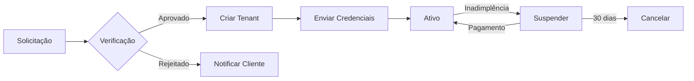
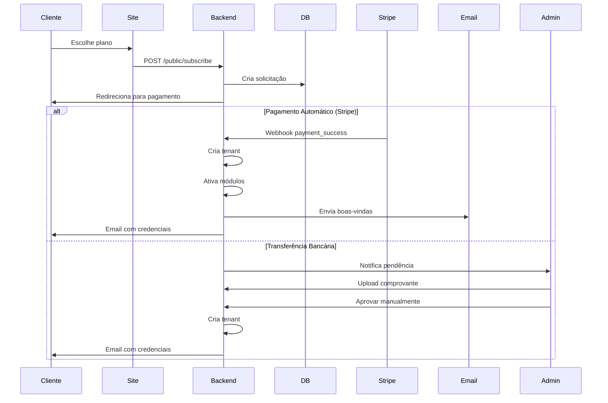
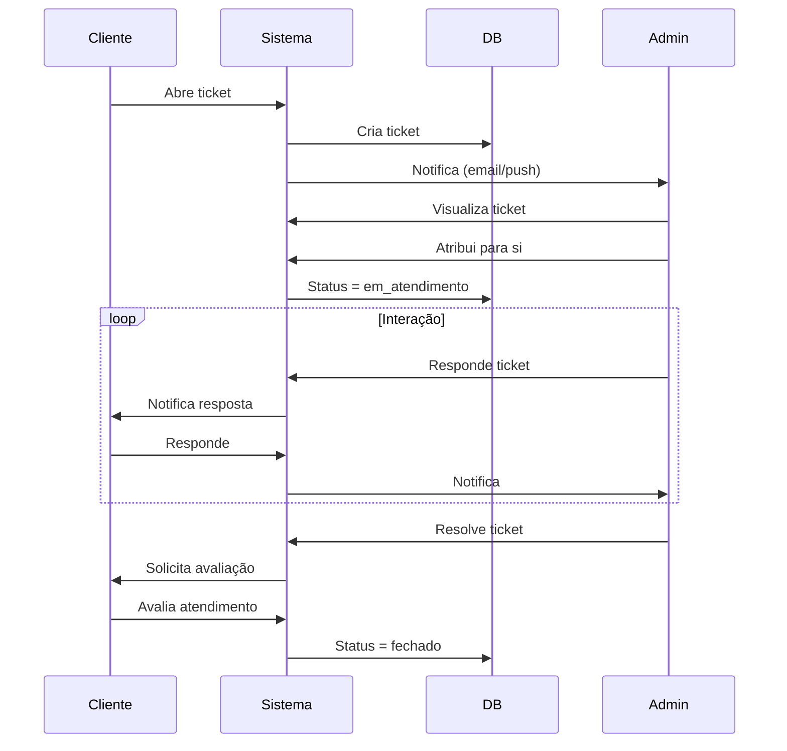
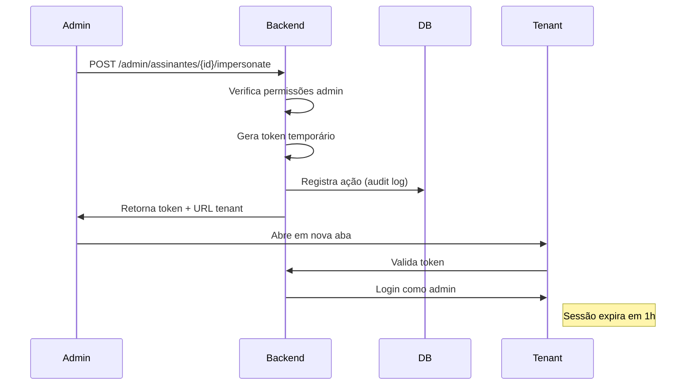

# 🏢 Estrutura Modular - Administração do SaaS

## 📋 Visão Geral

Este documento descreve a estrutura modular completa para a administração do AgroSaaS, organizando todas as funcionalidades administrativas em módulos bem definidos.

---

## 🎯 Módulos da Administração

### 📊 **ADMIN_DASHBOARD** - Dashboard Principal
**Código:** `ADM_DASHBOARD`
**Descrição:** Painel principal com visão geral do SaaS

#### KPIs e Métricas
```typescript
interface DashboardMetrics {
  // Métricas de Assinantes
  novosAssinantes: {
    total: number;
    periodo: 'mes' | 'trimestre' | 'ano';
    variacao: number; // percentual
  };

  assinantesAtivos: {
    total: number;
    percentual: number;
  };

  assinantesInativos: {
    total: number;
    percentual: number;
  };

  // Organização
  totalGruposFazendas: number;
  totalFazendas: number;

  // Suporte
  chamadosAbertos: number;
  chamadosPendentes: number;
  tempoMedioResposta: number; // em horas
  satisfacaoMedia: number; // 0-5

  // Receita (opcional)
  receitaMensal: number;
  taxaChurn: number;
  mrr: number; // Monthly Recurring Revenue
}
```

#### Componentes da Dashboard
1. **Cards de Métricas Principais**
   - Novos assinantes (com gráfico de tendência)
   - Assinantes ativos vs inativos
   - Total de grupos e fazendas
   - Status do suporte (chamados abertos)

2. **Gráfico de Novos Assinantes**
   - Linha do tempo dos últimos 12 meses
   - Comparação com período anterior
   - Filtros: mensal, trimestral, anual

3. **Alertas de Criticidade**
   - Assinantes com pagamento pendente
   - Tickets de suporte críticos
   - Recursos do sistema (storage, usuários)
   - Assinaturas próximas ao vencimento

4. **Atividades Recentes**
   - Últimas assinaturas criadas
   - Últimos tickets resolvidos
   - Mudanças de planos

---

### 👥 **ADMIN_ASSINANTES** - Gestão de Assinantes
**Código:** `ADM_ASSINANTES`
**Descrição:** Gerenciamento completo de assinantes

#### Funcionalidades

##### 1. Listagem de Assinantes
```typescript
interface Assinante {
  id: string;
  tenant_id: string;
  nome_empresa: string;
  nome_responsavel: string;
  email: string;
  telefone: string;

  // Status
  status: 'ativo' | 'trial' | 'suspenso' | 'cancelado' | 'inadimplente';
  data_cadastro: Date;
  data_ultimo_acesso: Date;

  // Plano
  plano_atual: {
    id: string;
    nome: string;
    valor: number;
    periodicidade: 'mensal' | 'anual';
  };

  // Métricas
  quantidade_usuarios: number;
  storage_usado: number; // GB
  storage_limite: number; // GB

  // Pagamento
  forma_pagamento: 'cartao' | 'boleto' | 'transferencia' | 'pix';
  proximo_vencimento: Date;
  inadimplencia_dias: number;
}
```

##### 2. Ações sobre Assinantes
- **Visualizar detalhes completos**
- **Entrar como Admin no Tenant**
  ```typescript
  // Gera token temporário de admin
  POST /admin/assinantes/{id}/impersonate
  Response: {
    access_token: string;
    tenant_url: string;
    expires_in: 3600; // 1 hora
  }
  ```

- **Resetar Senha**
  ```typescript
  POST /admin/assinantes/{id}/reset-password
  {
    enviar_email: boolean;
    senha_temporaria?: string; // Se não enviar, gera automático
    forcar_troca: boolean; // Obriga trocar no próximo login
  }

  // Template do Email
  Assunto: "Redefinição de Senha - AgroSaaS"

  Olá {nome_responsavel},

  Sua senha foi redefinida pelo administrador do sistema.

  Senha temporária: {senha_temporaria}

  Por segurança, você será obrigado a criar uma nova senha
  no próximo acesso ao sistema.

  Link de acesso: {tenant_url}

  Att,
  Equipe AgroSaaS
  ```

- **Alterar Plano**
- **Suspender/Reativar Assinatura**
- **Gerenciar Módulos Contratados**

##### 3. Filtros e Buscas
- Status (ativo, trial, suspenso, etc)
- Plano contratado
- Data de cadastro
- Inadimplência
- Storage utilizado
- Último acesso

---

### 📋 **ADMIN_ASSINATURAS** - Painel de Assinaturas
**Código:** `ADM_ASSINATURAS`
**Descrição:** Aprovação e gerenciamento de assinaturas

#### Funcionalidades

##### 1. Painel de Verificação
```typescript
interface SolicitacaoAssinatura {
  id: string;
  tipo: 'nova' | 'upgrade' | 'reativacao';

  // Dados da empresa
  empresa: {
    nome: string;
    cnpj: string;
    email: string;
    telefone: string;
  };

  // Plano solicitado
  plano: {
    id: string;
    nome: string;
    valor: number;
  };

  // Status
  status: 'pendente' | 'aprovado' | 'rejeitado' | 'aguardando_pagamento';
  data_solicitacao: Date;

  // Pagamento
  forma_pagamento: string;
  comprovante_url?: string;
}
```

##### 2. Ações
- **Aprovar Assinatura**
  - Cria tenant automaticamente
  - Envia email de boas-vindas
  - Ativa módulos do plano

- **Rejeitar Assinatura**
  - Registra motivo
  - Envia email de notificação

- **Suspender Assinatura**
  - Motivos: inadimplência, violação de termos, solicitação do cliente
  - Bloqueia acesso ao tenant
  - Mantém dados por período configur ável

##### 3. Workflow de Aprovação


---

### 🎫 **ADMIN_SUPORTE** - Sistema de Tickets
**Código:** `ADM_SUPORTE`
**Descrição:** Gerenciamento de suporte via tickets

#### Estrutura de Tickets

```typescript
interface Ticket {
  id: string;
  numero: string; // TICKET-2024-001234

  // Assinante
  tenant_id: string;
  tenant_nome: string;
  usuario_nome: string;
  usuario_email: string;

  // Classificação
  categoria: 'tecnico' | 'financeiro' | 'comercial' | 'duvida';
  prioridade: 'baixa' | 'normal' | 'alta' | 'critica';
  status: 'aberto' | 'em_atendimento' | 'aguardando_cliente' | 'resolvido' | 'fechado';

  // Conteúdo
  assunto: string;
  descricao: string;
  anexos: Anexo[];

  // Atendimento
  atendente_id?: string;
  atendente_nome?: string;
  data_abertura: Date;
  data_primeira_resposta?: Date;
  data_resolucao?: Date;
  sla_vencimento: Date;

  // Interações
  mensagens: TicketMensagem[];

  // Satisfação
  avaliacao?: {
    nota: number; // 1-5
    comentario?: string;
    data: Date;
  };
}

interface TicketMensagem {
  id: string;
  ticket_id: string;
  autor_tipo: 'cliente' | 'atendente' | 'sistema';
  autor_nome: string;
  mensagem: string;
  anexos: Anexo[];
  data: Date;
  visualizado: boolean;
}
```

#### Funcionalidades

##### 1. Dashboard de Tickets
- Tickets por status
- Tickets por prioridade
- SLA: tickets próximos ao vencimento
- Tempo médio de primeira resposta
- Tempo médio de resolução
- Taxa de satisfação

##### 2. Gestão de Tickets
- **Atribuir ticket** para atendente
- **Alterar prioridade**
- **Adicionar tags**
- **Responder ticket**
  - Editor rico (markdown)
  - Anexar arquivos
  - Templates de resposta
- **Escalar ticket**
- **Resolver/Fechar ticket**

##### 3. SLA (Service Level Agreement)
```typescript
const SLA_CONFIG = {
  critica: { primeira_resposta: 1, resolucao: 4 }, // horas
  alta: { primeira_resposta: 2, resolucao: 8 },
  normal: { primeira_resposta: 4, resolucao: 24 },
  baixa: { primeira_resposta: 8, resolucao: 48 }
};
```

##### 4. Templates de Resposta
```typescript
interface TemplateResposta {
  id: string;
  titulo: string;
  categoria: string;
  conteudo: string; // Suporta variáveis: {nome_usuario}, {tenant_nome}
  atalho: string; // Ex: /senha-reset
}
```

---

### 💼 **ADMIN_PACOTES** - Gerenciamento de Pacotes
**Código:** `ADM_PACOTES`
**Descrição:** Criação e gestão de planos comerciais

#### Estrutura de Pacotes

```typescript
interface PacoteComercial {
  id: string;
  codigo: string; // PLAN-BASIC, PLAN-PRO, etc

  // Informações Básicas
  nome: string;
  descricao: string;
  descricao_marketing: string; // Texto longo para página de vendas

  // Preços
  preco_mensal: number;
  preco_anual: number;
  desconto_anual: number; // percentual

  // Recursos
  max_usuarios_simultaneos: number;
  storage_gb: number;

  // Trial e Gratuidade
  tem_trial: boolean;
  dias_trial: number;
  is_free: boolean;

  // Módulos Incluídos
  modulos: string[]; // IDs dos módulos

  // Status
  ativo: boolean;
  destaque: boolean; // Aparece como "Mais Popular"
  ordem: number; // Ordem de exibição

  // Limites Adicionais
  limites_customizados?: {
    max_fazendas?: number;
    max_safras_ativas?: number;
    max_animais?: number;
    api_calls_mes?: number;
  };
}
```

#### Funcionalidades

##### 1. Listagem e Filtros
- Pacotes ativos/inativos
- Ordenação por preço, popularidade
- Busca por nome/código

##### 2. Criação/Edição de Pacote
**Formulário:**
```typescript
interface FormPacote {
  // Passo 1: Informações Básicas
  nome: string;
  descricao: string;
  codigo: string;

  // Passo 2: Preços
  preco_mensal: number;
  preco_anual: number;

  // Passo 3: Recursos
  max_usuarios: number;
  storage_gb: number;

  // Passo 4: Trial
  tem_trial: boolean;
  dias_trial?: number;

  // Passo 5: Módulos
  modulos_selecionados: string[];

  // Passo 6: Limites Customizados (opcional)
  limites?: Record<string, number>;
}
```

##### 3. Visualização de Pacote
- Preview da página de vendas
- Comparação com outros pacotes
- Lista de assinantes deste pacote

---

### 🎁 **ADMIN_CUPONS** - Cupons de Desconto
**Código:** `ADM_CUPONS`
**Descrição:** Gestão de cupons promocionais

```typescript
interface Cupom {
  id: string;
  codigo: string; // PROMO2024, BLACK50, etc

  // Tipo de Desconto
  tipo: 'percentual' | 'valor_fixo';
  valor: number;

  // Aplicação
  aplicavel_em: 'primeira_mensalidade' | 'todos_meses' | 'plano_anual';
  duracao_meses?: number; // Para aplicável em todos os meses

  // Restrições
  planos_validos?: string[]; // Se vazio, vale para todos
  uso_maximo: number; // Quantas vezes pode ser usado
  uso_atual: number;
  uso_por_cliente: number; // Ex: 1 = cada cliente usa 1x

  // Validade
  data_inicio: Date;
  data_fim: Date;
  ativo: boolean;

  // Tracking
  criado_por: string;
  criado_em: Date;
}
```

---

### 🏦 **ADMIN_FINANCEIRO** - Gestão Financeira
**Código:** `ADM_FINANCEIRO`
**Descrição:** Controle de pagamentos e conciliação

#### Submódulos

##### 1. Transferências Bancárias
```typescript
interface TransferenciaBancaria {
  id: string;

  // Dados da Transferência
  tenant_id: string;
  tenant_nome: string;
  valor: number;
  data_transferencia: Date;
  comprovante_url: string;

  // Conciliação
  status: 'pendente' | 'conciliado' | 'rejeitado';
  assinatura_id?: string;
  referencia_mes: string; // YYYY-MM

  // Processamento
  conciliado_por?: string;
  conciliado_em?: Date;
  observacoes?: string;
}
```

**Funcionalidades:**
- Upload de comprovantes
- Conciliação manual com assinaturas
- Relatório de transferências pendentes
- Histórico de conciliações

##### 2. Relatórios Financeiros
- MRR (Monthly Recurring Revenue)
- Churn rate
- Lifetime Value (LTV)
- Receita por plano
- Inadimplência

---

### 📧 **ADMIN_EMAILS** - Templates de Email
**Código:** `ADM_EMAILS`
**Descrição:** Gestão de templates de comunicação

```typescript
interface TemplateEmail {
  id: string;
  codigo: string; // WELCOME, TRIAL_ENDING, PAYMENT_FAILED, etc
  nome: string;

  // Conteúdo
  assunto: string;
  corpo_html: string;
  corpo_texto: string;

  // Variáveis Disponíveis
  variaveis: string[]; // Ex: {nome_usuario}, {tenant_nome}, {data_vencimento}

  // Configurações
  tipo: 'transacional' | 'marketing' | 'sistema';
  ativo: boolean;

  // Metadata
  ultima_edicao: Date;
  editado_por: string;
}
```

#### Templates Padrão

1. **WELCOME** - Boas-vindas
```html
Olá {nome_responsavel},

Bem-vindo ao AgroSaaS!

Sua conta foi criada com sucesso.

Dados de acesso:
- URL: {tenant_url}
- Email: {email}
- Senha: {senha_temporaria}

Comece agora: {link_primeiros_passos}

Att,
Equipe AgroSaaS
```

2. **TRIAL_ENDING** - Trial terminando
3. **PAYMENT_FAILED** - Falha no pagamento
4. **PASSWORD_RESET** - Reset de senha
5. **INVOICE** - Fatura gerada
6. **SUBSCRIPTION_CANCELLED** - Cancelamento

#### Editor de Templates
- Editor WYSIWYG
- Preview com dados de exemplo
- Teste de envio
- Histórico de alterações
- Variáveis dinâmicas autocomplete

---

### 🧩 **ADMIN_MODULOS** - Gestão de Módulos
**Código:** `ADM_MODULOS`
**Descrição:** Controle de módulos comercializáveis

```typescript
interface ModuloSistema {
  id: string;
  codigo: string; // A1_PLANEJAMENTO, P1_REBANHO, etc

  // Informações
  nome: string;
  descricao: string;
  icone: string;

  // Hierarquia
  dominio: 'agricola' | 'pecuaria' | 'financeiro' | 'operacional';
  modulo_pai?: string; // Para submódulos

  // Comercialização
  comercializavel: boolean;
  preco_adicional: number; // Se vendido separadamente

  // Dependências
  requer_modulos?: string[]; // Módulos obrigatórios

  // Status
  ativo: boolean;
  em_desenvolvimento: boolean;
  data_lancamento?: Date;
}
```

**Funcionalidades:**
- Ativar/desativar comercialização
- Definir preços adicionais
- Configurar dependências entre módulos
- Visualizar módulos por domínio

---

### ⚙️ **ADMIN_CONFIGURACOES** - Configurações do SaaS
**Código:** `ADM_CONFIGURACOES`
**Descrição:** Configurações gerais do sistema

#### Seções de Configuração

##### 1. Push Notifications (Pusher.com)
```typescript
interface ConfigPush {
  provider: 'pusher' | 'ably' | 'custom';

  pusher_config: {
    app_id: string;
    key: string;
    secret: string;
    cluster: string;
    encrypted: boolean;
  };

  ativo: boolean;
}
```

##### 2. Storage
```typescript
interface ConfigStorage {
  provider: 'local' | 's3' | 'cloudinary' | 'azure';

  // AWS S3
  s3_config?: {
    bucket: string;
    region: string;
    access_key: string;
    secret_key: string;
    public_url: string;
  };

  // Limites
  max_file_size_mb: number;
  allowed_extensions: string[];

  // Organização
  estrutura_pastas: 'tenant/{tenant_id}/{tipo}' | 'custom';
}
```

##### 3. SMTP
```typescript
interface ConfigSMTP {
  host: string;
  port: number;
  secure: boolean;

  auth: {
    user: string;
    pass: string;
  };

  from: {
    name: string;
    email: string;
  };

  // Limites
  max_emails_hora: number;

  // Template padrão
  footer_html: string;
}
```

##### 4. Transferência Bancária
```typescript
interface ConfigTransferenciaBancaria {
  ativo: boolean;

  dados_conta: {
    banco: string;
    agencia: string;
    conta: string;
    tipo_conta: 'corrente' | 'poupanca';
    titular: string;
    cpf_cnpj: string;
    pix?: string;
  };

  texto_instrucoes: string; // HTML

  // Comprovante
  requer_comprovante: boolean;
  aprovacao_manual: boolean;
}
```

##### 5. Stripe
```typescript
interface ConfigStripe {
  ativo: boolean;

  publishable_key: string;
  secret_key: string;
  webhook_secret: string;

  // Configurações
  moeda: string; // BRL, USD
  modo: 'test' | 'production';

  // Produtos Stripe
  produtos_sincronizados: {
    pacote_id: string;
    stripe_price_mensal: string;
    stripe_price_anual: string;
  }[];
}
```

##### 6. Configurações Gerais
```typescript
interface ConfigGerais {
  // Sistema
  nome_sistema: string;
  url_base: string;
  logo_url: string;

  // Tenants
  formato_subdomain: '{codigo}.agrosass.com' | 'agrosass.com/{codigo}';
  criar_tenant_automatico: boolean;

  // Trial
  trial_padrao_dias: number;

  // Limites
  max_tenants: number; // null = ilimitado
  max_usuarios_por_tenant: number;

  // Notificações
  email_notificacoes_admin: string[];
  notificar_nova_assinatura: boolean;
  notificar_cancelamento: boolean;
  notificar_inadimplencia: boolean;
}
```

---

## 🗺️ Estrutura de Navegação

### Menu Lateral (Admin)

```typescript
const ADMIN_MENU = {
  DASHBOARD: {
    icon: 'LayoutDashboard',
    label: 'Dashboard',
    href: '/admin/dashboard'
  },

  ASSINANTES: {
    icon: 'Users',
    label: 'Assinantes',
    submenu: [
      { label: 'Todos os Assinantes', href: '/admin/assinantes' },
      { label: 'Novos Cadastros', href: '/admin/assinantes/novos' },
      { label: 'Inativos', href: '/admin/assinantes/inativos' }
    ]
  },

  ASSINATURAS: {
    icon: 'FileCheck',
    label: 'Assinaturas',
    submenu: [
      { label: 'Pendentes Aprovação', href: '/admin/assinaturas/pendentes', badge: 'count' },
      { label: 'Histórico', href: '/admin/assinaturas/historico' },
      { label: 'Suspensas', href: '/admin/assinaturas/suspensas' }
    ]
  },

  SUPORTE: {
    icon: 'HeadsetIcon',
    label: 'Suporte',
    submenu: [
      { label: 'Tickets Abertos', href: '/admin/suporte/tickets', badge: 'count' },
      { label: 'Meus Tickets', href: '/admin/suporte/meus-tickets' },
      { label: 'Relatórios', href: '/admin/suporte/relatorios' }
    ]
  },

  COMERCIAL: {
    icon: 'ShoppingCart',
    label: 'Comercial',
    submenu: [
      { label: 'Pacotes', href: '/admin/pacotes' },
      { label: 'Módulos', href: '/admin/modulos' },
      { label: 'Cupons', href: '/admin/cupons' }
    ]
  },

  FINANCEIRO: {
    icon: 'DollarSign',
    label: 'Financeiro',
    submenu: [
      { label: 'Visão Geral', href: '/admin/financeiro' },
      { label: 'Transferências', href: '/admin/financeiro/transferencias' },
      { label: 'Relatórios', href: '/admin/financeiro/relatorios' }
    ]
  },

  COMUNICACAO: {
    icon: 'Mail',
    label: 'Comunicação',
    submenu: [
      { label: 'Templates de Email', href: '/admin/emails' },
      { label: 'Histórico de Envios', href: '/admin/emails/historico' }
    ]
  },

  CONFIGURACOES: {
    icon: 'Settings',
    label: 'Configurações',
    submenu: [
      { label: 'Geral', href: '/admin/config/geral' },
      { label: 'Storage', href: '/admin/config/storage' },
      { label: 'SMTP', href: '/admin/config/smtp' },
      { label: 'Push', href: '/admin/config/push' },
      { label: 'Pagamentos', href: '/admin/config/pagamentos' }
    ]
  }
};
```

---

## 🔐 Controle de Acesso

### Perfis Admin

```typescript
enum AdminRole {
  SUPER_ADMIN = 'super_admin', // Acesso total
  ADMIN = 'admin', // Acesso geral exceto config sensíveis
  SUPORTE = 'suporte', // Apenas tickets e assinantes (leitura)
  FINANCEIRO = 'financeiro', // Apenas módulo financeiro
  COMERCIAL = 'comercial' // Pacotes, cupons e assinaturas
}

const PERMISSIONS = {
  [AdminRole.SUPER_ADMIN]: ['*'],
  [AdminRole.ADMIN]: [
    'dashboard:view',
    'assinantes:*',
    'assinaturas:*',
    'suporte:*',
    'pacotes:*',
    'cupons:*',
    'modulos:view',
    'emails:*',
    'financeiro:view'
  ],
  [AdminRole.SUPORTE]: [
    'dashboard:view',
    'assinantes:view',
    'assinantes:reset-password',
    'suporte:*'
  ],
  [AdminRole.FINANCEIRO]: [
    'dashboard:view',
    'financeiro:*',
    'assinantes:view',
    'assinaturas:view'
  ],
  [AdminRole.COMERCIAL]: [
    'dashboard:view',
    'pacotes:*',
    'cupons:*',
    'assinaturas:*',
    'assinantes:view'
  ]
};
```

---

## 📂 Estrutura de Arquivos (Backend)

```
services/api/
├── app/
│   ├── admin/
│   │   ├── __init__.py
│   │   ├── router.py                    # Router principal admin
│   │   │
│   │   ├── dashboard/
│   │   │   ├── router.py
│   │   │   ├── service.py
│   │   │   └── schemas.py
│   │   │
│   │   ├── assinantes/
│   │   │   ├── router.py
│   │   │   ├── service.py
│   │   │   ├── schemas.py
│   │   │   └── actions/                 # Ações especiais
│   │   │       ├── impersonate.py
│   │   │       ├── reset_password.py
│   │   │       └── change_plan.py
│   │   │
│   │   ├── assinaturas/
│   │   │   ├── router.py
│   │   │   ├── service.py
│   │   │   ├── schemas.py
│   │   │   └── workflows/
│   │   │       ├── aprovacao.py
│   │   │       ├── suspensao.py
│   │   │       └── reativacao.py
│   │   │
│   │   ├── suporte/
│   │   │   ├── router.py
│   │   │   ├── service.py
│   │   │   ├── schemas.py
│   │   │   └── sla.py
│   │   │
│   │   ├── pacotes/
│   │   │   ├── router.py
│   │   │   ├── service.py
│   │   │   └── schemas.py
│   │   │
│   │   ├── cupons/
│   │   │   ├── router.py
│   │   │   ├── service.py
│   │   │   └── schemas.py
│   │   │
│   │   ├── financeiro/
│   │   │   ├── router.py
│   │   │   ├── service.py
│   │   │   ├── schemas.py
│   │   │   └── conciliacao.py
│   │   │
│   │   ├── emails/
│   │   │   ├── router.py
│   │   │   ├── service.py
│   │   │   ├── schemas.py
│   │   │   └── templates/               # Templates padrão
│   │   │       ├── welcome.html
│   │   │       ├── trial_ending.html
│   │   │       └── ...
│   │   │
│   │   ├── modulos/
│   │   │   ├── router.py
│   │   │   ├── service.py
│   │   │   └── schemas.py
│   │   │
│   │   └── config/
│   │       ├── router.py
│   │       ├── service.py
│   │       └── schemas.py
│   │
│   └── models/
│       ├── admin_user.py
│       ├── tenant.py
│       ├── subscription.py
│       ├── ticket.py
│       ├── package.py
│       ├── coupon.py
│       └── email_template.py
```

---

## 📂 Estrutura de Arquivos (Frontend)

```
apps/web/
├── src/
│   ├── app/
│   │   └── (admin)/                     # Layout separado
│   │       ├── layout.tsx               # Layout admin
│   │       ├── admin/
│   │       │   ├── dashboard/
│   │       │   │   └── page.tsx
│   │       │   │
│   │       │   ├── assinantes/
│   │       │   │   ├── page.tsx
│   │       │   │   ├── [id]/
│   │       │   │   │   ├── page.tsx     # Detalhes
│   │       │   │   │   └── editar/
│   │       │   │   │       └── page.tsx
│   │       │   │   └── components/
│   │       │   │       ├── assinante-card.tsx
│   │       │   │       ├── impersonate-button.tsx
│   │       │   │       └── reset-password-dialog.tsx
│   │       │   │
│   │       │   ├── assinaturas/
│   │       │   │   ├── page.tsx
│   │       │   │   ├── pendentes/
│   │       │   │   │   └── page.tsx
│   │       │   │   └── components/
│   │       │   │       ├── approval-card.tsx
│   │       │   │       └── suspension-dialog.tsx
│   │       │   │
│   │       │   ├── suporte/
│   │       │   │   ├── tickets/
│   │       │   │   │   ├── page.tsx
│   │       │   │   │   └── [id]/
│   │       │   │   │       └── page.tsx # Detalhes do ticket
│   │       │   │   └── components/
│   │       │   │       ├── ticket-list.tsx
│   │       │   │       ├── ticket-card.tsx
│   │       │   │       ├── ticket-response.tsx
│   │       │   │       └── sla-indicator.tsx
│   │       │   │
│   │       │   ├── pacotes/
│   │       │   │   ├── page.tsx
│   │       │   │   ├── novo/
│   │       │   │   │   └── page.tsx
│   │       │   │   └── [id]/
│   │       │   │       └── editar/
│   │       │   │           └── page.tsx
│   │       │   │
│   │       │   ├── cupons/
│   │       │   │   ├── page.tsx
│   │       │   │   └── components/
│   │       │   │       ├── coupon-form.tsx
│   │       │   │       └── coupon-usage.tsx
│   │       │   │
│   │       │   ├── financeiro/
│   │       │   │   ├── page.tsx
│   │       │   │   ├── transferencias/
│   │       │   │   │   └── page.tsx
│   │       │   │   └── components/
│   │       │   │       ├── mrr-chart.tsx
│   │       │   │       ├── churn-chart.tsx
│   │       │   │       └── conciliation-table.tsx
│   │       │   │
│   │       │   ├── emails/
│   │       │   │   ├── page.tsx
│   │       │   │   ├── [id]/
│   │       │   │   │   └── editar/
│   │       │   │   │       └── page.tsx
│   │       │   │   └── components/
│   │       │   │       ├── template-editor.tsx
│   │       │   │       ├── variable-selector.tsx
│   │       │   │       └── email-preview.tsx
│   │       │   │
│   │       │   ├── modulos/
│   │       │   │   ├── page.tsx
│   │       │   │   └── components/
│   │       │   │       └── module-tree.tsx
│   │       │   │
│   │       │   └── config/
│   │       │       ├── geral/
│   │       │       │   └── page.tsx
│   │       │       ├── storage/
│   │       │       │   └── page.tsx
│   │       │       ├── smtp/
│   │       │       │   └── page.tsx
│   │       │       ├── push/
│   │       │       │   └── page.tsx
│   │       │       └── pagamentos/
│   │       │           └── page.tsx
│   │       │
│   │       └── components/
│   │           ├── admin-sidebar.tsx
│   │           ├── admin-header.tsx
│   │           └── admin-breadcrumb.tsx
│   │
│   ├── lib/
│   │   ├── api/
│   │   │   └── admin/
│   │   │       ├── assinantes.ts
│   │   │       ├── assinaturas.ts
│   │   │       ├── suporte.ts
│   │   │       ├── pacotes.ts
│   │   │       ├── cupons.ts
│   │   │       ├── financeiro.ts
│   │   │       ├── emails.ts
│   │   │       └── config.ts
│   │   │
│   │   └── stores/
│   │       └── admin-store.ts
│   │
│   └── components/
│       └── admin/
│           ├── dashboard/
│           │   ├── metrics-card.tsx
│           │   ├── subscribers-chart.tsx
│           │   └── critical-alerts.tsx
│           │
│           ├── shared/
│           │   ├── status-badge.tsx
│           │   ├── admin-table.tsx
│           │   └── search-filter.tsx
│           │
│           └── forms/
│               ├── package-form.tsx
│               ├── coupon-form.tsx
│               └── config-form.tsx
```

---

## 🔄 Fluxos de Trabalho Principais

### 1. Nova Assinatura (Automático)



### 2. Suporte via Ticket



### 3. Impersonação de Tenant



---

## 🎨 Componentes Reutilizáveis

### StatusBadge
```tsx
// Para status de assinantes, tickets, etc
<StatusBadge status="ativo" />
<StatusBadge status="trial" />
<StatusBadge status="suspenso" />
```

### MetricCard
```tsx
// Cards de métricas
<MetricCard
  title="Novos Assinantes"
  value={127}
  change={+12.5}
  period="vs. mês anterior"
  icon={<Users />}
/>
```

### DataTable
```tsx
// Tabela com filtros, ordenação e paginação
<DataTable
  columns={assinantesColumns}
  data={assinantes}
  searchable
  filterable
  sortable
  pagination
/>
```

---

## 🚀 Próximos Passos

### Fase 1: Backend (Semana 1-2)
- [ ] Criar modelos de banco de dados
- [ ] Implementar rotas de Dashboard
- [ ] Implementar gestão de Assinantes
- [ ] Implementar sistema de Tickets
- [ ] Configurar permissões admin

### Fase 2: Frontend (Semana 3-4)
- [ ] Criar layout admin
- [ ] Implementar Dashboard
- [ ] Implementar gestão de Assinantes
- [ ] Implementar sistema de Suporte
- [ ] Implementar gestão de Pacotes

### Fase 3: Integração (Semana 5)
- [ ] Integrar Stripe
- [ ] Configurar envio de emails
- [ ] Implementar storage
- [ ] Configurar push notifications
- [ ] Testes end-to-end

### Fase 4: Polimento (Semana 6)
- [ ] Ajustes de UX
- [ ] Otimizações de performance
- [ ] Documentação completa
- [ ] Deploy em produção

---

**Última atualização:** 2026-03-10
**Versão:** 1.0
**Autor:** Sistema AgroSaaS
