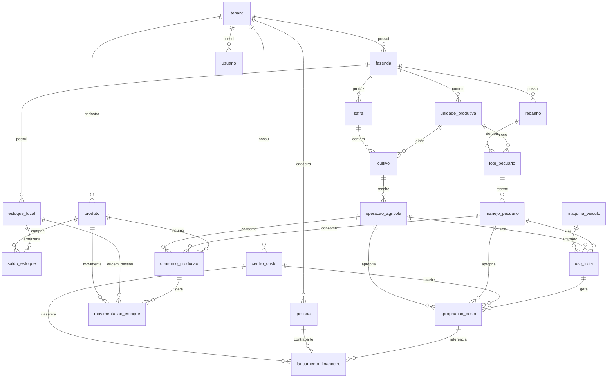

# Step 47 - Modelo de Dados Unificado Cross-Módulos

## Objetivo

Definir um modelo ER lógico e unificado para o SaaS agro, conectando Agricultura, Pecuária e módulos integradores sem duplicar cadastros, estoque, financeiro ou frota.

## Escopo

- Documento de arquitetura de dados.
- Não implementa código.
- Não cria migrations.
- Não altera gates existentes.
- Define tabelas, relacionamentos, ownership e fonte da verdade.
- Usa a matriz cross-módulo do Step 46 como base conceitual.

## Princípios do Modelo

- Toda tabela operacional deve carregar `tenant_id`.
- `tenant`, `fazenda`, `unidade_produtiva`, `pessoa` e `usuario` pertencem ao Core.
- Agricultura e Pecuária são módulos produtivos equivalentes.
- Estoque, Financeiro e Frota/Máquinas são módulos integradores.
- Produto, estoque, centro de custo, movimentação financeira e movimentação de estoque não devem ser duplicados em módulos produtivos.
- Entidades produtivas podem ter tabelas próprias, mas devem referenciar entidades compartilhadas.

## ER Lógico

## Entidades Core

| Tabela | Ownership | Fonte da verdade | Cria | Consome | Campos principais |
|---|---|---|---|---|---|
| `tenant` | Core | Core | Backoffice, onboarding | Todos os módulos | `id`, `nome`, `documento`, `status`, `plano_id`, `created_at` |
| `fazenda` | Core | Core | Owner/admin do tenant | Todos os módulos | `id`, `tenant_id`, `nome`, `documento`, `area_total`, `municipio`, `uf`, `ativa` |
| `unidade_produtiva` | Core com especialização operacional | Core | Core, Agricultura, Pecuária | Agricultura, Pecuária, Estoque, Financeiro, Relatórios | `id`, `tenant_id`, `fazenda_id`, `tipo`, `nome`, `area`, `capacidade`, `geometria`, `ativa` |
| `pessoa` | Core / Pessoas | Core / Pessoas | Core, Compras, Vendas, Financeiro | Compras, Vendas, Financeiro, Fiscal, Pecuária | `id`, `tenant_id`, `tipo`, `nome`, `documento`, `email`, `telefone`, `papel_json`, `ativa` |
| `usuario` | Core | Core | Owner/admin, backoffice | Todos os módulos | `id`, `tenant_id`, `pessoa_id`, `email`, `nome`, `role`, `status`, `ultimo_acesso_em` |

### Regras Core

- `unidade_produtiva.tipo` deve permitir especializações como `talhao`, `piquete`, `curral`, `galpao`, `almoxarifado_area`, `sede` e `outro`.
- Papéis comerciais não geram tabelas duplicadas: fornecedor e cliente são papéis de `pessoa`.
- Permissões e escopo de acesso são avaliados a partir de `usuario`, `tenant` e vínculos com `fazenda` quando houver restrição por fazenda.

## Entidades Compartilhadas

| Tabela | Ownership | Fonte da verdade | Cria | Consome | Campos principais |
|---|---|---|---|---|---|
| `produto` | Estoque | Estoque | Estoque, Compras, importação fiscal | Agricultura, Pecuária, Frota, Compras, Fiscal, Financeiro | `id`, `tenant_id`, `nome`, `categoria`, `tipo`, `unidade_medida`, `ncm`, `ativo` |
| `estoque_local` | Estoque | Estoque | Estoque | Estoque, Compras, Agricultura, Pecuária, Frota | `id`, `tenant_id`, `fazenda_id`, `unidade_produtiva_id`, `nome`, `tipo`, `ativo` |
| `saldo_estoque` | Estoque | Estoque | Sistema via movimentações | Estoque, Agricultura, Pecuária, Compras, Fiscal | `id`, `tenant_id`, `produto_id`, `estoque_local_id`, `quantidade`, `custo_medio`, `atualizado_em` |
| `movimentacao_estoque` | Estoque | Estoque | Estoque, Compras, Agricultura, Pecuária, Frota, Vendas | Estoque, Financeiro, Fiscal, Rastreabilidade | `id`, `tenant_id`, `produto_id`, `estoque_origem_id`, `estoque_destino_id`, `tipo`, `quantidade`, `custo_unitario`, `origem_tipo`, `origem_id`, `data_movimento` |
| `centro_custo` | Financeiro | Financeiro | Financeiro, Core via templates | Agricultura, Pecuária, Frota, Compras, Relatórios | `id`, `tenant_id`, `fazenda_id`, `tipo`, `nome`, `referencia_tipo`, `referencia_id`, `ativo` |
| `lancamento_financeiro` | Financeiro | Financeiro | Financeiro, Compras, Vendas, Estoque, módulos produtivos via integração | Financeiro, Contabilidade, Dashboards | `id`, `tenant_id`, `fazenda_id`, `centro_custo_id`, `pessoa_id`, `tipo`, `categoria`, `valor`, `data_competencia`, `data_caixa`, `status`, `origem_tipo`, `origem_id` |

### Regras Compartilhadas

- `saldo_estoque` é estado derivado; a trilha auditável é `movimentacao_estoque`.
- `movimentacao_estoque.origem_tipo` e `origem_id` conectam consumo agrícola, manejo pecuário, compra, venda, ajuste ou transferência.
- `lancamento_financeiro.origem_tipo` e `origem_id` conectam operação produtiva, compra, venda, manutenção, ajuste ou lançamento manual.
- `centro_custo.referencia_tipo` e `referencia_id` permitem vincular custo a `safra`, `cultivo`, `rebanho`, `lote_pecuario`, `maquina_veiculo`, `fazenda` ou `unidade_produtiva`.

## Entidades Produtivas - Agricultura

| Tabela | Ownership | Fonte da verdade | Cria | Consome | Campos principais |
|---|---|---|---|---|---|
| `safra` | Agricultura | Agricultura | Agricultura | Financeiro, Estoque, Vendas, Relatórios | `id`, `tenant_id`, `fazenda_id`, `nome`, `ano_inicio`, `ano_fim`, `status` |
| `cultivo` | Agricultura | Agricultura | Agricultura | Financeiro, Estoque, Rastreabilidade, Relatórios | `id`, `tenant_id`, `safra_id`, `unidade_produtiva_id`, `cultura`, `variedade`, `area`, `data_plantio`, `data_colheita_prevista`, `status` |
| `operacao_agricola` | Agricultura | Agricultura | Agricultura | Estoque, Financeiro, Frota, Rastreabilidade | `id`, `tenant_id`, `cultivo_id`, `unidade_produtiva_id`, `tipo`, `data_operacao`, `responsavel_usuario_id`, `status`, `observacoes` |

### Regras de Agricultura

- `safra` organiza o período produtivo.
- `cultivo` conecta safra, cultura e unidade produtiva, normalmente um talhão.
- `operacao_agricola` registra plantio, aplicação, adubação, pulverização, colheita, monitoramento ou outra atividade.
- Consumo de insumos agrícolas deve referenciar `operacao_agricola` e gerar `movimentacao_estoque` quando Estoque estiver contratado.
- Custos devem ser apropriados via `apropriacao_custo` e consolidados em `lancamento_financeiro` quando Financeiro estiver contratado.

## Entidades Produtivas - Pecuária

| Tabela | Ownership | Fonte da verdade | Cria | Consome | Campos principais |
|---|---|---|---|---|---|
| `rebanho` | Pecuária | Pecuária | Pecuária | Financeiro, Estoque, Vendas, Relatórios | `id`, `tenant_id`, `fazenda_id`, `nome`, `especie`, `finalidade`, `status` |
| `lote_pecuario` | Pecuária | Pecuária | Pecuária | Financeiro, Estoque, Rastreabilidade, Relatórios | `id`, `tenant_id`, `rebanho_id`, `unidade_produtiva_id`, `nome`, `categoria`, `quantidade_animais`, `peso_medio`, `status` |
| `manejo_pecuario` | Pecuária | Pecuária | Pecuária | Estoque, Financeiro, Frota, Rastreabilidade | `id`, `tenant_id`, `lote_pecuario_id`, `unidade_produtiva_id`, `tipo`, `data_manejo`, `responsavel_usuario_id`, `status`, `observacoes` |

### Regras de Pecuária

- `rebanho` representa a estrutura produtiva animal da fazenda.
- `lote_pecuario` agrupa animais por finalidade, categoria, manejo ou fase.
- `manejo_pecuario` registra vacinação, pesagem, movimentação, reprodução, sanidade, nutrição, trato ou outro manejo.
- Consumo de vacinas, medicamentos, ração ou sal deve referenciar `manejo_pecuario` e gerar `movimentacao_estoque` quando Estoque estiver contratado.
- Custos e receitas pecuárias devem ser consolidados no Financeiro, não mantidos apenas dentro da Pecuária.

## Integrações Operacionais

### Consumo de Produção

| Tabela | Ownership | Fonte da verdade | Cria | Consome | Campos principais |
|---|---|---|---|---|---|
| `consumo_producao` | Módulo produtivo com execução no Estoque | Estoque para quantidade/custo; módulo produtivo para contexto | Agricultura, Pecuária, Frota | Estoque, Financeiro, Rastreabilidade | `id`, `tenant_id`, `origem_tipo`, `origem_id`, `produto_id`, `quantidade`, `unidade_medida`, `movimentacao_estoque_id`, `data_consumo` |

Regras:

- `origem_tipo` deve aceitar `operacao_agricola`, `manejo_pecuario` e `uso_frota`.
- A operação produtiva informa contexto, produto e quantidade consumida.
- Estoque valida saldo, custo e gera a `movimentacao_estoque`.
- Financeiro pode usar o custo da movimentação para apropriação econômica.

### Custo e Receita

| Tabela | Ownership | Fonte da verdade | Cria | Consome | Campos principais |
|---|---|---|---|---|---|
| `apropriacao_custo` | Financeiro | Financeiro | Financeiro, Agricultura, Pecuária, Frota via integração | Dashboards, Agricultura, Pecuária, Contabilidade | `id`, `tenant_id`, `centro_custo_id`, `origem_tipo`, `origem_id`, `lancamento_financeiro_id`, `valor`, `criterio_rateio`, `data_competencia` |

Regras:

- Custos diretos de insumos podem nascer do Estoque e ser apropriados ao cultivo, lote, rebanho, máquina ou fazenda.
- Custos operacionais podem nascer de Frota/Máquinas e ser apropriados à operação agrícola ou manejo pecuário.
- Receitas de venda devem ser `lancamento_financeiro.tipo = receita` e referenciar origem comercial quando Vendas estiver contratado.
- Lançamentos manuais são permitidos, mas devem informar centro de custo quando o tenant usa gestão gerencial.

### Frota e Máquinas

| Tabela | Ownership | Fonte da verdade | Cria | Consome | Campos principais |
|---|---|---|---|---|---|
| `maquina_veiculo` | Frota / Máquinas | Frota / Máquinas | Frota, Máquinas | Agricultura, Pecuária, Financeiro, Estoque | `id`, `tenant_id`, `fazenda_id`, `tipo`, `nome`, `placa`, `horimetro_atual`, `odometro_atual`, `status` |
| `uso_frota` | Frota / Máquinas | Frota / Máquinas | Agricultura, Pecuária, Frota | Financeiro, Estoque, Relatórios | `id`, `tenant_id`, `maquina_veiculo_id`, `origem_tipo`, `origem_id`, `data_uso`, `horas`, `km`, `combustivel_estimado`, `operador_usuario_id` |

Regras:

- `origem_tipo` deve aceitar `operacao_agricola`, `manejo_pecuario`, `manutencao` ou `uso_manual`.
- Abastecimento e peças são produtos do Estoque.
- Horas, km, combustível e manutenção alimentam `apropriacao_custo`.
- Agricultura e Pecuária consomem frota como recurso operacional, mas Frota/Máquinas segue como fonte da verdade do equipamento.

## Ownership Consolidado

| Tabela | Fonte da verdade | Criadores permitidos | Consumidores principais |
|---|---|---|---|
| `tenant` | Core | Backoffice, onboarding | Todos |
| `fazenda` | Core | Core, owner/admin | Todos |
| `unidade_produtiva` | Core | Core, Agricultura, Pecuária | Agricultura, Pecuária, Financeiro, Estoque |
| `pessoa` | Core / Pessoas | Core, Compras, Vendas, Financeiro | Compras, Vendas, Fiscal, Financeiro |
| `usuario` | Core | Core, owner/admin | Todos |
| `produto` | Estoque | Estoque, Compras, Fiscal import | Agricultura, Pecuária, Frota, Compras |
| `estoque_local` | Estoque | Estoque | Estoque, Compras, módulos produtivos |
| `saldo_estoque` | Estoque | Sistema via Estoque | Estoque, dashboards, módulos produtivos |
| `movimentacao_estoque` | Estoque | Estoque e integrações autorizadas | Estoque, Financeiro, Fiscal |
| `centro_custo` | Financeiro | Financeiro | Agricultura, Pecuária, Frota, Relatórios |
| `lancamento_financeiro` | Financeiro | Financeiro e integrações autorizadas | Financeiro, Contabilidade, Dashboards |
| `safra` | Agricultura | Agricultura | Financeiro, Estoque, Vendas |
| `cultivo` | Agricultura | Agricultura | Financeiro, Estoque, Rastreabilidade |
| `operacao_agricola` | Agricultura | Agricultura | Estoque, Financeiro, Frota |
| `rebanho` | Pecuária | Pecuária | Financeiro, Estoque, Vendas |
| `lote_pecuario` | Pecuária | Pecuária | Financeiro, Estoque, Rastreabilidade |
| `manejo_pecuario` | Pecuária | Pecuária | Estoque, Financeiro, Frota |
| `consumo_producao` | Estoque + módulo produtivo | Agricultura, Pecuária, Frota | Estoque, Financeiro, Rastreabilidade |
| `apropriacao_custo` | Financeiro | Financeiro e integrações autorizadas | Dashboards, Contabilidade, módulos produtivos |
| `maquina_veiculo` | Frota / Máquinas | Frota, Máquinas | Agricultura, Pecuária, Financeiro |
| `uso_frota` | Frota / Máquinas | Frota, Agricultura, Pecuária | Financeiro, Estoque, Relatórios |

## Relacionamentos e Cardinalidade

| Relação | Cardinalidade | Observação |
|---|---:|---|
| `tenant` -> `fazenda` | 1:N | Toda fazenda pertence a um tenant. |
| `fazenda` -> `unidade_produtiva` | 1:N | Uma fazenda possui talhões, piquetes, currais e outras áreas. |
| `tenant` -> `pessoa` | 1:N | Pessoa é única por tenant, com papéis múltiplos. |
| `tenant` -> `usuario` | 1:N | Usuário pode se vincular a uma pessoa. |
| `fazenda` -> `safra` | 1:N | Safra é produtiva agrícola e vinculada à fazenda. |
| `safra` -> `cultivo` | 1:N | Safra pode ter múltiplos cultivos. |
| `unidade_produtiva` -> `cultivo` | 1:N | Um talhão pode receber múltiplos cultivos ao longo do tempo. |
| `cultivo` -> `operacao_agricola` | 1:N | Operações pertencem a um cultivo. |
| `fazenda` -> `rebanho` | 1:N | Rebanho pertence à fazenda. |
| `rebanho` -> `lote_pecuario` | 1:N | Rebanho contém lotes. |
| `unidade_produtiva` -> `lote_pecuario` | 1:N | Um piquete/curral pode receber lotes ao longo do tempo. |
| `lote_pecuario` -> `manejo_pecuario` | 1:N | Manejos pertencem a um lote. |
| `produto` -> `movimentacao_estoque` | 1:N | Toda movimentação referencia um produto. |
| `centro_custo` -> `lancamento_financeiro` | 1:N | Lançamentos podem ser classificados gerencialmente. |
| `maquina_veiculo` -> `uso_frota` | 1:N | Um equipamento pode ser usado em várias atividades. |

## Diretrizes de Integridade

- Todas as FKs devem respeitar o mesmo `tenant_id`.
- Exclusão física deve ser evitada em tabelas operacionais; preferir `status`, `ativo` ou estorno.
- Movimentações de estoque e lançamentos financeiros devem ser imutáveis após confirmação; correções por estorno.
- Tabelas produtivas podem editar planejamento, mas eventos executados devem manter trilha de auditoria.
- Campos polimórficos `origem_tipo/origem_id` e `referencia_tipo/referencia_id` devem ser restritos por enum controlado, não texto livre.
- Dashboards devem ler fontes canônicas: Estoque para saldos, Financeiro para valores, Agricultura/Pecuária para contexto produtivo e Frota para equipamento.

## Fora do Escopo Nesta Etapa

- Modelagem fiscal detalhada de NF-e, GTA, LCDPR e SPED.
- Modelagem individual de animal.
- Modelagem de compras e vendas completas.
- Estratégia física de índices, particionamento e migrations.
- Alteração de gates, planos ou permissões já implementadas.

## Critérios de Aceite

- Entidades Core modeladas com ownership.
- Entidades compartilhadas modeladas com fonte da verdade.
- Agricultura e Pecuária modeladas como módulos produtivos equivalentes.
- Integrações Estoque, Financeiro e Frota/Máquinas documentadas.
- Ownership claro por tabela: quem cria, quem consome e quem é fonte da verdade.
- Nenhuma alteração de código ou gate realizada.
